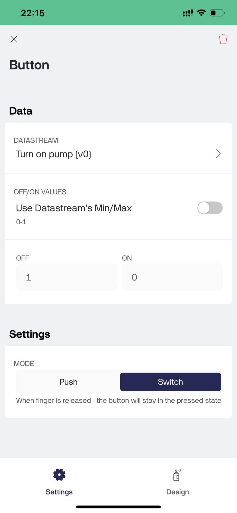

# Smart fire detection system using Raspbbery Pi
The system detects, alarms and sends notifications with images to the phone when there is a fire. Turn the pump on and off remotely via your phone.
1. Raspberry Pi: Raspberry  Pi 4 model B used in project.
2. Model Convolution neural network used to detecting fire:\
   Dataset using for training: [dataset](https://drive.google.com/drive/folders/1eDbUsYpi8hhWzGVeI6DLN6IdoN4kYBmU?usp=sharing)\
   Layers in the model: \
   
4. Connect Blynk to control water pump
   - Creat a template in [your Blynk](https://blynk.cloud)\
     Swicth setting:\
      
      \
     Virtual Pin: \
     
   - Install Blynk app in your smart phone, then connect to website \
     Setting button in your App: \
     
   - Use your "BLYNK_AUTH_TOKEN" to connect Raspberry Pi with Blynk for remotely control waterpump
5. Send notification to WhatsApp:
   - Using Google Cloud Storage, Twilio.
# Demo
 

